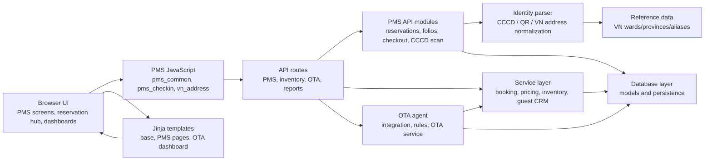

# Architecture

## Overview

This project is a hotel/PMS-oriented web application with backend APIs, service-layer business logic, database models, templates, and browser-side JavaScript for operational workflows. GitNexus currently indexes the project as `binbinops` with 295 files, 11,757 symbols, 16,342 relationships, 577 clusters, and 300 execution flows.

The strongest execution-flow signals are around PMS identity/CCCD scanning, Vietnamese address normalization, reservation/check-in flows, room/detail payment flows, OTA synchronization, and inventory/reporting support.

## Functional areas

| Area | Symbols | Cohesion | Role |
| --- | ---: | ---: | --- |
| `Pms` | 754 | 74% | Main property-management workflows: reservations, check-in/out, folios, identity parsing, payment, room operations, and related frontend interactions. |
| `Api` | 65 | 87% | HTTP API surface and route orchestration for app features. |
| `Ota_agent` | 49 | 83% | OTA agent integration, rule extraction, and OTA service coordination. |
| `Js` | 49 | 75% | Shared browser-side behavior across PMS and dashboard screens. |
| `Services` | 48 | 82% | Backend business services such as booking, pricing, inventory, guest CRM, and operational logic. |
| `Scripts` | 19 | 89% | Utility or maintenance scripts. |
| `Inventory` | 10 | 100% | Inventory-specific API/export logic. |
| `Schemas` | 8 | 100% | Request/response or domain schemas. |
| `Manager` | 8 | 100% | Management-facing orchestration. |
| `Db` | 6 | 91% | Database models/session/data access foundation. |
| `Reception_request` | 6 | 100% | Reception request handling. |
| `Reservation_hub` | 5 | 100% | Reservation hub UI and interaction slice. |

## Key execution flows

### 1. CCCD card-type detection with ward/province data loading

`Detect_card_type → _load_data`

1. `detect_card_type` in `app/api/pms/identity_parser.py`
2. `_detect_can_cuoc_moi_special` in `app/api/pms/identity_parser.py`
3. `_is_ward_in_province` in `app/api/pms/identity_parser.py`
4. `_get_province_ward_set` in `app/api/pms/identity_parser.py`
5. `_resolve_province_data_key` in `app/api/pms/identity_parser.py`
6. `_get_alias_reverse_map` in `app/api/pms/identity_parser.py`
7. `_load_new_wards_cache` in `app/api/pms/identity_parser.py`
8. `_load_data` in `app/api/pms/identity_parser.py`

This flow identifies Vietnamese identity-card variants and depends on normalized administrative geography data.

### 2. Browser-side CCCD scanner binding and address cleanup

`PmsBindScanCCCD → _pmsNormAddrToken`

1. `pmsBindScanCCCD` in `app/static/js/pms/pms_common.js`
2. `_flush` in `app/static/js/pms/pms_common.js`
3. `pmsParseScanCCCD` in `app/static/js/pms/pms_common.js`
4. `_pmsParseAddressVN` in `app/static/js/pms/pms_common.js`
5. `_pmsRepairQrAddress` in `app/static/js/pms/pms_common.js`
6. `_pmsDedupeTrailingWardProvince` in `app/static/js/pms/pms_common.js`
7. `_pmsNormAddrToken` in `app/static/js/pms/pms_common.js`

This flow handles QR/scan input from the PMS UI and normalizes Vietnamese address segments before form population.

### 3. Applying reservation guest data into check-in forms

`PmsCiApplyReservationGuest → Normalize`

1. `pmsCiApplyReservationGuest` in `app/static/js/pms/pms_checkin.js`
2. `vnSwitchMode` in `app/static/js/pms/vn_address.js`
3. `vnOnProvinceChange` in `app/static/js/pms/vn_address.js`
4. `vnOnNewProvinceChange` in `app/static/js/pms/vn_address.js`
5. `vnGetOpt` in `app/static/js/pms/vn_address.js`
6. `vnNormVietnamese` in `app/static/js/pms/vn_address.js`
7. `normalize` in `app/static/js/pms/reservation_hub/form.js`

This flow bridges reservation data, Vietnamese address selectors, and reservation-hub form normalization.

### 4. CCCD card-type detection with normalized comparisons

`Detect_card_type → _normalize_for_compare`

1. `detect_card_type` in `app/api/pms/identity_parser.py`
2. `_detect_can_cuoc_moi_special` in `app/api/pms/identity_parser.py`
3. `_is_ward_in_province` in `app/api/pms/identity_parser.py`
4. `_get_province_ward_set` in `app/api/pms/identity_parser.py`
5. `_resolve_province_data_key` in `app/api/pms/identity_parser.py`
6. `_get_alias_reverse_map` in `app/api/pms/identity_parser.py`
7. `_normalize_for_compare` in `app/api/pms/identity_parser.py`

This flow uses text normalization to compare scanned identity/address data against canonical geography aliases.

### 5. CCCD scan API to backend identity parser

`Api_scan_cccd → _normalize_for_compare`

1. `api_scan_cccd` in `app/api/pms/cccd_scan_api.py`
2. `parse_qr` in `app/api/pms/identity_parser.py`
3. `detect_card_type` in `app/api/pms/identity_parser.py`
4. `_detect_can_cuoc_moi_special` in `app/api/pms/identity_parser.py`
5. `_is_district_in_province` in `app/api/pms/identity_parser.py`
6. `_normalize_for_compare` in `app/api/pms/identity_parser.py`

This flow is the backend entry point for scanned CCCD data and routes through QR parsing, card detection, and normalized district/province matching.

## Architecture diagram

## Operational notes

- GitNexus analysis initially reported a missing LadybugDB index; running `npx gitnexus analyze --skip-git` regenerated the local graph because this folder currently lacks a usable `.git` repository directory.
- The analyzer reported scope-extraction failures for several Python files, but still completed successfully and produced an updated graph.
- Since Git metadata is unavailable, GitNexus commit tracking and incremental updates are disabled until the `.git` repository metadata is restored.
